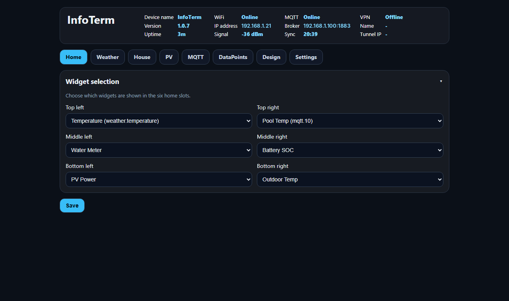
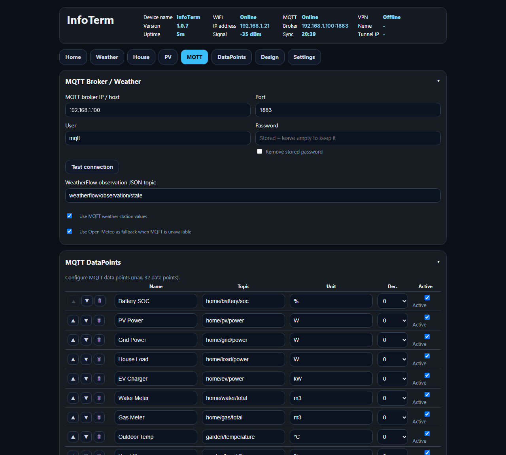
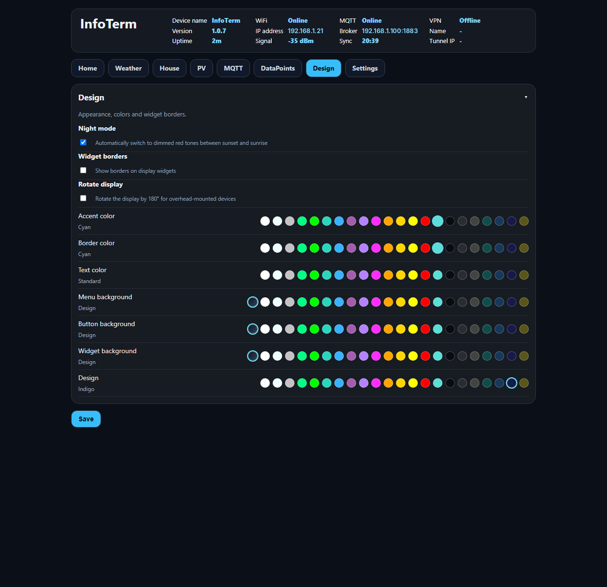
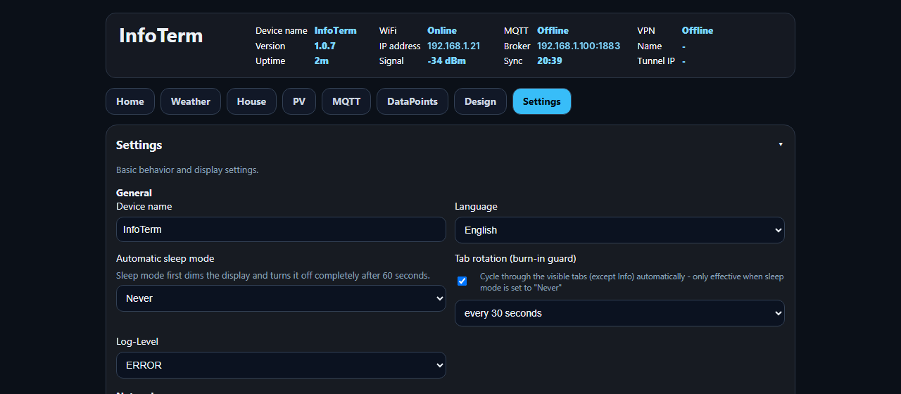

# InfoTerm

**InfoTerm** is a multilingual ESP32-based information dashboard for weather data,
MQTT values, DataPoints, widgets, device status and an inline WebGUI.



The current version is maintained centrally in `include/Version.h`; see
[docs/RELEASE_NOTES.md](docs/RELEASE_NOTES.md) and
[CHANGELOG.md](CHANGELOG.md) for the version history and per-release details.

## Hardware

ESP32 Touchscreen 2.8 inch TFT LCD display ESP-WROOM-32 ILI9341/ST7789
compatible board, commonly sold as ESP32-2432S028R.

https://a.aliexpress.com/_EQB88PY

## Features

- Touchscreen dashboard with configurable pages, widgets and custom tabs
- Multilingual user interface — 8 languages (DE, EN, FR, ES, IT, RU, HI, ZH;
  the TFT display falls back to English for non-Latin scripts)
- Weather via MQTT weather station (WeatherFlow2MQTT) with Open-Meteo fallback
- Dynamic MQTT DataPoints with per-value formatting and a live DataPoints tab
- Inline WebGUI (no separate filesystem upload needed) with login,
  per-boot CSRF protection, connection test, log view and OTA progress
- Design themes with a 22-color palette, night mode and 180-degree rotation
- OTA firmware update with automatic rollback guard
- Configuration backup/restore as JSON (secrets are never exported)
- Optional on-demand WireGuard VPN client
- Multi-WiFi with automatic fallback and a SoftAP onboarding portal for
  first-time setup without editing any config files
- Persistent configuration (NVS) that survives reflash cycles
- PlatformIO-based build with host-side unit tests and CI

## Screenshots

**MQTT DataPoints** — map any MQTT topic to a named value with unit,
decimals and visibility, then place it on the display as a widget:



**Design** — 22-color palette for accent, borders, text and backgrounds,
plus night mode and 180° display rotation:



**Settings** — language, sleep mode, tab rotation (burn-in guard) and more;
network, location, backup/restore, OTA update, log view and VPN live on the
same page:



## Project Structure

```text
InfoTerm/
├── README.md
├── CHANGELOG.md
├── CONTRIBUTING.md
├── CODE_OF_CONDUCT.md
├── SECURITY.md
├── LICENSE
├── platformio.ini
├── partitions_infoterm.csv
├── include/
├── src/
├── hardware/
├── docs/
├── test/
└── tools/
```

Project documentation lives in `docs/`. Version history lives in `CHANGELOG.md`
and `docs/RELEASE_NOTES.md`.

## Quick Start

### Option 1: Prebuilt firmware (existing InfoTerm device)

Each [release](https://github.com/spofastic/InfoTerm/releases) ships an
`InfoTerm_x_y_z_public.bin` with no credentials baked in. On a device already
running InfoTerm (1.0.4 or newer), upload it via the WebGUI
(Settings → Firmware). Wi-Fi is configured through the SoftAP setup portal
or the WebGUI; the default WebGUI login is `admin` / `infoterm` — change it
under Settings → Network → WebGUI access.

(The release `.bin` is the application image only — a factory-fresh board
needs one initial build-and-upload from source, see Option 2.)

### Option 2: Build from source with PlatformIO

1. Open the `InfoTerm` folder in VS Code.
2. Install the PlatformIO IDE extension.
3. Optional: create `include/Config.local.h` (git-ignored) with pre-seeded
   Wi-Fi networks and your own WebGUI login — see `docs/CONFIGURATION.md`.
   Without it, the first boot opens the SoftAP setup portal
   (`InfoTerm-Setup-XXXX`, password `infoterm`) so you can join your Wi-Fi
   from a phone; no config files needed.
4. Build and upload the firmware:

```bash
platformio run --environment esp32_2432s028r -t upload
```

5. Open the device IP address (or `http://<devicename>.local`) in your browser.

## Build Check

```bash
platformio run --environment esp32_2432s028r
```

## Documentation

- [Setup Guide](docs/SETUP_GUIDE.md)
- [Configuration](docs/CONFIGURATION.md)
- [Architecture](docs/ARCHITECTURE.md)
- [Modularization](docs/MODULARIZATION.md)
- [MQTT](docs/MQTT.md)
- [Language System](docs/LANGUAGE.md)
- [Supported Hardware](docs/SUPPORTED_HARDWARE.md)
- [Release Notes](docs/RELEASE_NOTES.md)
- [Credits](docs/CREDITS.md)

## Versioning

The application version is maintained only in `include/Version.h`. WebGUI,
DataPoints, status output and module version labels must use the central version
macros instead of hard-coded app versions.

## License

This project is licensed under the MIT License. See [LICENSE](LICENSE).
